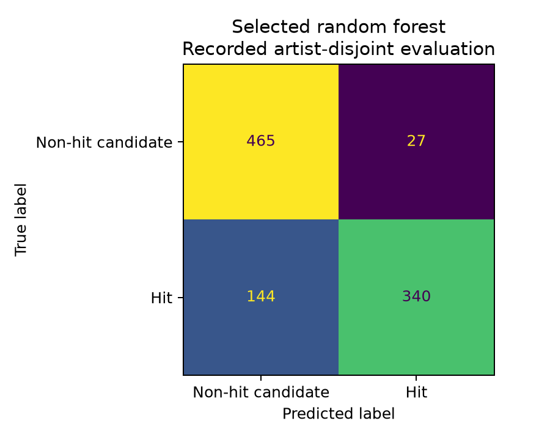

# HitPredict Song Hit Classification Project Report

## Abstract

HitPredict investigates whether a song's audio characteristics and an artist's earlier chart history can help distinguish chart hits from non-hit candidates. The project combines audio descriptors from the Million Song Dataset with historical Billboard Hot 100 records. The retained modeling dataset contains 4,000 songs, equally divided between 2,000 hits and 2,000 non-hit candidates, representing 2,660 normalized artist keys. Each song is described by tempo, loudness, duration, and a binary Artist Score indicating an earlier chart appearance by the same artist for a different song.

The implementation covers data extraction, identity normalization, exact source matching, label construction, chronological feature engineering, balanced sampling, exploratory analysis, preprocessing pipelines, nested cross-validation, hyperparameter search, threshold selection, feature ablation, model comparison, held-out evaluation, serialization, and command-line inference. The original benchmark evaluates logistic regression, three support vector machine variants, a decision tree, a random forest, and a small neural network. A subsequent course-scoped workflow evaluates logistic and polynomial logistic regression, decision trees, bagging, random forests, AdaBoost, and gradient boosting.

The selected inference model is the original random forest using all four inputs. Its recorded evaluation on 976 artist-disjoint held-out songs gives 82.48% accuracy, 92.64% precision, 70.25% recall, F1 0.7991 and ROC-AUC 0.8767. The forest had the highest observed test accuracy among the original classifiers and was chosen for deployment after reviewing those results. This is a deployment revision, not a fresh independent evaluation. A separate later forest reaches 82.77% mean cross-validation accuracy and remains a development candidate. Earlier artist chart history provides the strongest predictive signal.

## 1 Introduction and Problem Definition

Music success depends on many factors, including musical characteristics, established audiences, promotion, distribution, and changing listener preferences. This project examines a restricted, measurable part of that problem: classification using three audio descriptors and one historical artist feature. The task is binary supervised classification rather than prediction of chart rank, sales, streaming volume, or the exact week in which a song will become popular.

The target is `hit`. A value of 1 identifies a song matched to a Billboard Hot 100 appearance in the configured label window. A value of 0 identifies an eligible Million Song Dataset song with no exact canonical overlap in the available chart-history window. The second class is therefore described as non-hit candidates: an absent exact match cannot prove that a song never charted.

The predictor receives X = [tempo, loudness, duration, artist_score] and estimates a class or classification score. The central questions are whether these inputs offer useful discrimination, how much prior artist history adds, and whether results persist when validation separates artists. An artist-disjoint split tests generalization to unseen normalized artist keys; it does not implement a chronological future-release test.

### 1.1 Project Objectives

- Construct an auditable song-level dataset by linking audio descriptors and chart records.
- Engineer Artist Score using strictly earlier chart events while excluding the current song.
- Compare linear, nonlinear, tree, and ensemble classifiers under consistent experimental protocols.
- Measure the contribution of audio features and artist history through feature ablation.
- Prevent target, preprocessing, tuning, and artist-group leakage during evaluation.
- Preserve fitted models, configurations, predictions, and executable replay code.
- Provide a command-line prediction interface for the frozen selected model.

### 1.2 Scope of the Implemented Work

The project is a Mode B methodology reproduction using Million Song Dataset descriptors. It does not numerically reproduce a Spotify-feature experiment. Danceability and energy are excluded because the documented MSD release provides them as constant zero values. The active four-feature representation contains no lyrics, waveform inputs, spectral features, streaming statistics, or promotion variables.

Two completed stages are documented. The original benchmark supplies the saved random forest now used for inference. Later development compares course-scoped regression, trees and ensembles and remains separate. The command-line and Streamlit demo source load the same verified original forest pipeline. The live demo URL is https://hitpredict-demo.streamlit.app/.

## 2 Dataset and Data Sources

### 2.1 Million Song Dataset

The Million Song Dataset is a collection of audio descriptors and metadata for one million tracks. The project uses its HDF5 summary file, rather than downloading or analyzing raw audio recordings. The extraction module reads the metadata, analysis, and MusicBrainz tables, verifies that their lengths agree, decodes text fields, and processes records in chunks of 100,000. It extracts track ID, song ID, title, artist name, year, duration, tempo, and loudness. These fields support identity matching, filtering, and the three audio inputs. [Million Song Dataset](https://millionsongdataset.com/)

The retained extraction summary records 1,000,000 rows, 484,424 rows with missing or zero year values, and 135,212 rows belonging to duplicated canonical identities. The latter is a count of rows in duplicate groups, not the number of rows ultimately discarded. The raw summary's maximum recorded year is 2011. The final sampled table contains MSD years from 1990 through 2010.

### 2.2 Billboard Hot 100 History

Chart labels and Artist Score are derived from the `all.json` archive maintained in the `mhollingshead/billboard-hot-100` repository. This is a third-party historical chart archive. Its documented records contain chart dates, song titles, artist credits, current positions, peak positions, and weeks on chart. The project parses the fields needed for identity matching and event chronology. Chart outcomes are used to construct labels and history, then excluded from model inputs. [Archive and schema](https://github.com/mhollingshead/billboard-hot-100)

The configured hit-label window is January 1, 1990 to December 31, 2018. The artist-history window starts on January 1, 1986 and ends on December 31, 2018. The earlier history allows songs near the beginning of the label window to receive evidence of previous artist chart appearances. These are configured search windows; they do not imply that the final sample contains releases from every year through 2018. Final song reference dates range from January 1, 1990 to February 6, 2016.

### 2.3 Dataset Construction Counts

Table 1 reports the preserved construction audit. The candidate count is after valid-feature and identity filtering, year restriction, and deterministic identity deduplication.

| Construction stage | Count |
| --- | ---: |
| MSD summary input rows | 1,000,000 |
| Rows rejected for invalid identity or required audio values | 3,389 |
| Unique eligible MSD candidates in the label-year window | 396,141 |
| Unique Billboard song identities in the label window | 10,878 |
| Positive identities matched to MSD before sampling | 2,538 |
| Unresolved Billboard identities | 8,340 |
| Non-hit candidate pool before balancing | 393,544 |
| Final hits sampled | 2,000 |
| Final non-hit candidates sampled | 2,000 |
| Final modeling rows | 4,000 |
| Conflicting label identities in the final table | 0 |

Only about 23.33% of the 10,878 eligible Billboard identities matched the retained matching procedure and MSD candidates. This coverage restriction can bias the positive sample toward songs and artist credits that match cleanly. The difference between all eligible candidates and the negative pool is not simply the positive count: the negative pool excludes overlaps with the broader artist-history window.

### 2.4 Label Construction and Sampling

Positive songs are formed by an exact join between normalized Billboard and MSD song identities. Repeated chart appearances are collapsed to one identity, using the first chart appearance within the label window as the positive reference date. A chart appearance anywhere in the Hot 100 qualifies under this definition; the code does not impose a top-ten or number-one requirement.

Negative candidates are eligible MSD identities with no exact overlap anywhere in the configured 1986 to 2018 chart-history window. Their reference dates are approximated as January 1 of their MSD year. The two classes are sampled independently using seed 42, with a target of 2,000 rows each. The final table is sorted by reference date and canonical identity. This is balanced undersampling from the available pools; no synthetic examples are generated.

## 3 Data Cleaning and Preprocessing

### 3.1 Identity Normalization and Matching

Artist and title normalization preserves original source strings and creates separate comparison keys. The procedure applies Unicode NFKC normalization, case folding, accent transliteration, whitespace cleanup, and punctuation removal. The title routine can remove narrowly defined terminal version markers such as remastered, radio edit, live, single version, and album version. The active configuration enables this title-version cleanup.

A canonical song key combines the normalized artist key and normalized title key. Matching accepts exact equality of these keys. Fuzzy matching is disabled. Unresolved Billboard songs are retained in an audit and excluded from the positive training pool rather than assigned approximate audio features. Duplicate MSD identities are ordered by canonical key, year, and track ID, then the first row is retained deterministically. Collaboration credits and alternate names can still create distinct keys for the same performer.

### 3.2 Numeric Validation and Missing Values

The construction pipeline coerces year and required audio fields to numeric values. It rejects rows with empty normalized artist or title identities, nonfinite required audio descriptors, nonpositive tempo, or nonpositive duration. Year filtering excludes entries outside the label-year range, including missing or zero years. The retained modeling table has complete finite values in every permitted feature, unique track IDs, and no conflicting labels.

Model pipelines still include median imputation for the three continuous audio columns. This provides a consistent reusable preprocessing component, although the current dataset requires no missing-value replacements. Imputation statistics are fitted inside each training fold. Artist Score is passed through as a binary feature and is validated as 0 or 1 rather than median-imputed.

### 3.3 Scaling and Feature Routing

A `ColumnTransformer` applies preprocessing only to a whitelist of approved inputs and drops all remaining columns. Logistic regression, support vector machines, and the neural network standardize continuous features using z = (x - training mean) / training standard deviation. Artist Score remains unchanged. Decision trees and tree ensembles use median imputation without standardization, because their splitting rules do not require standardized feature scales.

Each preprocessing component is contained in the same scikit-learn `Pipeline` as the classifier. Consequently, each cross-validation fit estimates its imputation and scaling parameters only from that fold's fitting rows. Validation and test rows are transformed with the already fitted components. This avoids using holdout distributions to influence preprocessing.

### 3.4 Outlier Review

Exploratory analysis flags values outside pooled 1.5-IQR fences for inspection. It identifies 55 unusual tempo values, 168 loudness values, and 331 duration values. The observed ranges are 10.456 to 248.640 BPM, -48.671 to -0.678 dB, and 13.009 to 2,513.162 seconds. The long maximum duration is approximately 41.9 minutes and may represent a recording unlike a conventional single.

These flags do not remove or clip rows. No winsorization, log-duration transformation, or fitted outlier-removal procedure is implemented in the active modeling pipelines. Any future clipping bounds or transformations should be learned within training partitions rather than from the complete dataset.

## 4 Feature Engineering and Exploratory Analysis

### 4.1 Model Inputs and Metadata

| Feature | Type and unit | Meaning |
| --- | --- | --- |
| `tempo` | Continuous, BPM | Estimated rate of musical beats |
| `loudness` | Continuous, dB | Overall audio loudness descriptor |
| `duration` | Continuous, seconds | Length of the recorded track |
| `artist_score` | Binary, 0 or 1 | Earlier chart appearance by the same normalized artist for another song |

Track IDs, song IDs, names, normalized keys, year, and reference dates support joins, grouping, audits, and interpretation. They are metadata rather than predictor inputs. The target `hit` is also excluded from the predictor matrix. Matching method, matching confidence, and source provenance are kept in separate audits because they can reveal how the label was assigned. Rank, peak position, and weeks on chart are never used as model features.

### 4.2 Chronological Artist Score

For a song with artist a, canonical identity s, and reference date t, Artist Score is 1 if the retained history contains a chart event for artist a with event date earlier than t and canonical identity different from s. Otherwise, it is 0. The current song is excluded even if it appeared earlier within the available history. This prevents a song from creating its own prior-hit indicator.

For every row, an audit records the artist, reference date, score, and, when available, an earlier song title and chart date supporting the score. Chronology is checked explicitly. Artist Score is an indicator, not a count of hits or a weighted popularity measure. In the final table, 1,407 hits (70.35%) and 121 non-hit candidates (6.05%) have Artist Score 1.

There is an important timing limitation. Positive reference dates are first chart appearances in the label window, while negative dates approximate release as January 1 of the MSD year. The feature obeys the implemented reference-date rule but does not establish that all input history would have been available at a verified pre-release prediction date.

### 4.3 Descriptive Statistics

| Variable | Non-hit candidate mean | Hit mean | Correlation with hit |
| --- | ---: | ---: | ---: |
| Tempo | 125.424 BPM | 121.566 BPM | -0.059 |
| Loudness | -9.354 dB | -6.936 dB | 0.297 |
| Duration | 246.723 seconds | 254.123 seconds | 0.038 |
| Artist Score | 0.0605 | 0.7035 | 0.662 |

Hits are louder on average in this sample, while mean tempo and duration differ less between classes. Artist Score has the strongest descriptive relationship with the target. These correlations do not establish causal effects. The weak marginal correlations of tempo and duration also do not rule out nonlinear interactions, which motivate the nonlinear and tree-based methods.

### 4.4 Feature Ablation and Polynomial Expansion

The original benchmark evaluates three predefined feature sets: audio only, audio plus Artist Score, and Artist Score only. The first contains tempo, loudness, and duration; the second contains all four inputs. Artist Score only is a diagnostic that measures how far artist history alone can explain classification performance. It is excluded from final deployment-model selection. No automatic feature-selection algorithm or principal component analysis is used.

The newer polynomial logistic model expands the four processed inputs to degree two using `PolynomialFeatures(include_bias=False)`. This generates four first-order terms, four squared terms, and six pairwise interactions, for 14 generated columns. Artist Score squared duplicates Artist Score numerically because the original feature is binary. The implementation retains this generated column and uses regularization. An additional scaler is fitted after expansion before logistic regression. [PolynomialFeatures documentation](https://scikit-learn.org/stable/modules/generated/sklearn.preprocessing.PolynomialFeatures.html)

## 5 Experimental Design

### 5.1 Training and Test Partitions

The split generator saves one assignment per track for each of two protocols and records seed 42, dataset and split hashes, counts, and artist overlap. The model loader verifies these hashes and joins split assignments to the modeling table one to one.

| Protocol | Training rows | Training hits | Test rows | Test hits | Shared artist keys |
| --- | ---: | ---: | ---: | ---: | ---: |
| Stratified 75 to 25 | 3,000 | 1,500 | 1,000 | 500 | 263 |
| Artist-disjoint | 3,024 | 1,516 | 976 | 484 | 0 |

The conventional stratified split preserves class balance but allows different songs from the same normalized artist in training and test. The primary artist-disjoint split reserves approximately 25% of distinct artist keys, so its song-level proportions and class counts are approximate. No key appears in both partitions. Historical artist features can still exist for a test artist; artist-disjoint evaluation separates training examples, not access to prior chart history.

The two protocols share the underlying dataset and are not independent replications. A score difference between them cannot be interpreted solely as the effect of artist overlap because their test songs also differ. Both protocols are random historical partitions rather than chronological splits.

### 5.2 Nested Cross Validation

Within each training partition, the original benchmark uses five outer validation folds and five inner tuning folds. Stratified folds are used for the conventional protocol; `StratifiedGroupKFold` uses artist keys for the grouped protocol. Grouped folds preserve class proportions as far as possible while keeping artist groups separate. The code checks row separation, the presence of both classes, artist separation, and exactly one outer validation prediction per training row. [Grouped cross-validation documentation](https://scikit-learn.org/stable/modules/generated/sklearn.model_selection.StratifiedGroupKFold.html)

For each outer fold, inner cross-validation searches model parameters using only the outer fitting subset. Preprocessing is refitted within each inner fit. The selected estimator is refitted on the outer fitting subset and evaluated on the untouched outer validation rows. Reported development metrics are means across five outer folds, with sample standard deviations where available. A separate inner search on all training rows chooses the parameters for the final training-partition model.

The original stage selects parameters primarily by ROC-AUC. The newer course-scoped stage selects them by accuracy and uses only the 3,024 original artist-disjoint training rows. It does not load the previously evaluated test partitions. Cross-validation helps separate tuning from evaluation, but repeated selection of families using development results still calls for an independent final test. [Cross-validation guide](https://scikit-learn.org/stable/modules/cross_validation.html)

### 5.3 Bounded Hyperparameter Searches

Searches use `GridSearchCV` over declared settings. When a full Cartesian grid exceeds the configured budget, a deterministic seed-based subset is selected without replacement. Some v2 tree and forest searches include declared anchor configurations. This approach bounds computation and makes the searched settings reproducible; it does not evaluate every possible parameter combination.

In v2, the number of searched settings per stage is 6 for logistic regression, 6 for polynomial logistic regression, 18 for decision trees, 8 for bagged trees, 12 for random forests, 8 for AdaBoost, and 12 for gradient boosting. Across five outer stages plus one full-training stage, these produce 420 setting-stage records. The final saved set contains 42 fitted threshold-aware pipelines, corresponding to six saved models per family.

### 5.4 Classification Threshold Selection

The original probability-based models use their default classification rule, normally a probability cutoff of 0.5. SVM predictions use the classifier's decision boundary and expose uncalibrated decision margins rather than probabilities.

The newer workflow first chooses parameters by inner validation accuracy. It then generates inner out-of-fold probabilities using the chosen parameter setting and selects a cutoff that maximizes accuracy on these fitting-data predictions. Candidate cutoffs include the distinct observed probabilities and boundary values. Ties prefer the cutoff nearest 0.5, then the lower cutoff. A `FixedThresholdClassifier` stores the decision rule, predicting a hit when the score is greater than or equal to the cutoff.

Each outer fold has its own selected threshold; outer validation labels never choose it. The final candidate cutoff is independently chosen on out-of-fold predictions from the full training partition. Since threshold fitting reuses fitting data already involved in parameter selection, its own optimization score is not an independent performance estimate. The separate outer-fold evaluation measures the complete parameter-and-threshold procedure.

## 6 Implemented Classification Methods

Across both stages, the project implements eleven distinct classifier families plus a dummy reference baseline. Logistic regression, decision trees, and random forests occur in both stages with different tuning objectives and search configurations.

### 6.1 Dummy Prior Baseline

`DummyClassifier(strategy="prior")` estimates class frequencies without learning feature effects. Its classification follows the majority class and its ROC-AUC is 0.5. In this balanced task its accuracy is approximately 50%. It provides a reference for judging whether learned classifiers improve beyond class prevalence.

### 6.2 Logistic Regression

Logistic regression estimates p(hit | X) = 1 / (1 + exp(-(b + wX))). It offers an interpretable linear relationship in log-odds and a probability output. The implementation uses the L-BFGS solver, an L2 regularization setting, a maximum of 5,000 iterations, and tolerance 0.000001. The original search uses C values 0.01, 0.1, 1, 10, and 100. The v2 search adds 0.001. Smaller C gives stronger regularization. Numeric inputs are standardized while Artist Score passes through unchanged.

### 6.3 Linear Support Vector Machine

`LinearSVC` learns a linear separating boundary with L2 penalty and squared-hinge loss. The implementation sets `dual=False`, a maximum of 10,000 iterations, and tolerance 0.000001. It searches C values 0.1, 1, 10, and 100. The model provides a decision margin. Its margin is used for ranking metrics, but is not interpreted as a calibrated hit probability.

### 6.4 Radial Basis Function Support Vector Machine

The RBF SVM uses similarity K(x, z) = exp(-gamma times squared distance(x, z)) to represent nonlinear boundaries. The search combines C values 0.1, 1, 10, and 100 with gamma values `scale`, 0.01, 0.1, and 1, giving 16 settings per tuning stage. It uses a 512 MB kernel cache and `probability=False`. Standardization prevents differences in audio units from dominating distance calculations.

### 6.5 Polynomial Support Vector Machine

The polynomial SVM uses K(x, z) = (gamma times dot(x, z) + coef0) raised to degree. It searches C in 0.1, 1, and 10; gamma in `scale` and 0.01; degree in 2 and 3; and coef0 in 0 and 1. A reproducible subset of 12 settings is evaluated from the 24-setting grid. This is a kernel classifier and is distinct from explicitly generating polynomial columns for logistic regression. It also produces uncalibrated margins.

### 6.6 Decision Tree

`DecisionTreeClassifier` learns recursive feature thresholds that partition songs into class regions. Depth limits and minimum leaf sizes reduce overfitting. The original search uses maximum depths 2, 4, 8, or unrestricted and minimum leaf sizes 1, 5, or 20. The frozen original decision tree has maximum depth 8 and minimum leaf size 20.

The v2 tree search expands depths to 2, 4, 6, 8, 12, or unrestricted; leaf sizes to 5, 10, 20, or 40; and cost-complexity pruning alpha to 0, 0.001, or 0.005. It evaluates 18 settings from 72 possible combinations. Accuracy-based v2 fitting selects a shallower final tree with depth 2, leaf size 20, and pruning alpha 0.

### 6.7 Random Forest

Random forests combine independently fitted trees using bootstrap sampling and random feature subsets. Averaging tree probabilities can reduce the variance of an individual tree. Both stages use 300 trees and CPU fitting. The original bounded search evaluates six settings from 18 combinations of depth, leaf size, and split-feature count.

The v2 search evaluates 12 settings from 64 combinations: depth 4, 6, 10, or unrestricted; leaf size 2, 5, 10, or 30; split features `sqrt` or all features; and bootstrap sample fraction 0.7 or 1.0. The final v2 candidate uses depth 10, leaf size 5, square-root feature selection, full-size bootstrap samples, and threshold approximately 0.567497.

### 6.8 Six Unit Neural Network

The original `MLPClassifier` has one hidden layer with six units, logistic hidden activation, and an L-BFGS optimizer. It uses a maximum of 5,000 iterations, a maximum of 50,000 function evaluations, tolerance 0.00001, and no internal early-stopping validation split. The alpha regularization search uses 0.00001, 0.0001, 0.001, and 0.01. This is a small tabular classifier, not a waveform or spectrogram model. It belongs to the original benchmark and is not included in the newer course-scoped workflow.

### 6.9 Polynomial Logistic Regression

The v2 polynomial model combines explicit degree-two feature expansion with logistic regression. Its expansion allows squared effects and pairwise feature interactions while retaining a logistic classification output. It searches the same six C values as v2 logistic regression, uses L-BFGS, allows 10,000 iterations, and standardizes the expanded representation. The final training-partition setting uses degree 2 and C = 10.

### 6.10 Bagged Decision Trees

`BaggingClassifier` combines 150 trees fitted on bootstrap samples. The grid varies base-tree depth among 3, 6, and unrestricted, base-tree minimum leaf size between 5 and 20, and sample fraction between 0.7 and 1.0. Eight settings are evaluated from twelve combinations. Bagging addresses tree instability through repeated sampling; the forest additionally randomizes features at individual splits. The final bagging configuration uses depth 6, leaf size 20, sample fraction 0.7, and threshold approximately 0.495267.

### 6.11 AdaBoost

`AdaBoostClassifier` builds a sequence of shallow trees, adjusting emphasis toward previously misclassified training examples. The bounded search evaluates eight settings from twelve combinations of 50 or 150 estimators, learning rates 0.03, 0.1, or 0.5, and base-tree depths 1 or 2. Base trees retain minimum leaf size 10. The final configuration uses 50 depth-one trees, learning rate 0.5, and threshold approximately 0.566596.

### 6.12 Gradient Boosting

`GradientBoostingClassifier` sequentially adds trees to improve a classification loss. The grid combines 100 or 200 estimators, learning rates 0.03 or 0.1, depths 1, 2, or 3, minimum leaf sizes 10 or 30, and subsampling fractions 0.7 or 1.0. Twelve settings are evaluated from 48 combinations. Internal early stopping is disabled. The final configuration uses 200 depth-one trees, learning rate 0.1, minimum leaf size 30, subsampling 0.7, and threshold approximately 0.505141. [Ensemble methods guide](https://scikit-learn.org/stable/modules/ensemble.html)

## 7 Evaluation Metrics and Diagnostics

Accuracy measures the proportion of correctly classified songs. Precision measures the proportion of predicted hits that are labeled hits, while recall measures the proportion of labeled hits recovered. F1 combines precision and recall. The implementation also records true negatives, false positives, false negatives, and true positives in confusion matrices.

| Metric | Definition or interpretation |
| --- | --- |
| Accuracy | (TP + TN) / (TP + TN + FP + FN) |
| Precision | TP / (TP + FP) |
| Recall | TP / (TP + FN) |
| F1 | 2 times precision times recall / (precision + recall) |
| ROC-AUC | Ranking discrimination across decision cutoffs |
| Average precision | Summary of precision-recall ranking performance |
| Log loss | Penalty on incorrect probability assignments |
| Brier score | Mean squared error of probabilities against binary labels |

ROC-AUC and average precision accept either class probabilities or decision margins. Log loss and Brier score are computed only for models that provide probabilities; they are intentionally absent for the uncalibrated SVMs. Precision and recall concern the hit class. Undefined precision or F1 cases return zero using the configured metric behavior.

The original workflow includes fixed-parameter seed-stability checks using seeds 42, 7, and 123, and shuffled-training-label diagnostics. For the logistic baseline, seed-stability accuracy averages about 82.2%, while shuffled-label accuracy averages about 52.5% with ROC-AUC about 0.524. The shuffled-label result is a sanity check consistent with much weaker discrimination after the association is disrupted; it is not proof that every possible leakage path is absent.

Saved outputs include ROC and precision-recall curves, confusion matrices, and reliability plots for probability-producing models. Reliability plots inspect probability quality; the project does not fit a separate calibration model. Model serialization checks compare predicted classes and scores before saving and after reloading.

The original training workflow exports coefficients and impurity-based feature importances. In the selected forest, Artist Score accounts for 0.6880 of total impurity importance, loudness for 0.1282, duration for 0.1259 and tempo for 0.0579. These values describe reductions in impurity across the fitted trees. They are neither percentages of accuracy nor causal effects.

The full-feature artist-disjoint logistic model has coefficients of approximately -0.1871 for standardized tempo, 0.6576 for standardized loudness, 0.1027 for standardized duration, and 3.5317 for the unscaled binary Artist Score. Numeric coefficients describe changes per training-standard-deviation unit, whereas Artist Score describes a change from 0 to 1. Their signs and magnitudes support interpretation of the fitted model within this sample, with the ablation providing a separate predictive comparison.

## 8 Original Benchmark Results

### 8.1 Primary Held Out Results

The following table reports the original fitted models with all four inputs on the same 976-song artist-disjoint test partition. Values come from saved evaluation records. The random forest has the highest observed test accuracy and is now used for inference. Its deployment choice followed review of these results, so the score is reported as existing evaluation evidence.

| Model | Accuracy | Precision | Recall | F1 | ROC-AUC | Average precision |
| --- | ---: | ---: | ---: | ---: | ---: | ---: |
| Logistic regression | 81.45% | 0.9084 | 0.6963 | 0.7883 | 0.8668 | 0.8698 |
| Linear SVM | 81.56% | 0.9108 | 0.6963 | 0.7892 | 0.8668 | 0.8696 |
| RBF SVM | 81.76% | 0.9158 | 0.6963 | 0.7911 | 0.8724 | 0.8764 |
| Polynomial SVM | 81.56% | 0.9108 | 0.6963 | 0.7892 | 0.8776 | 0.8799 |
| Decision tree | 79.20% | 0.8172 | 0.7479 | 0.7810 | 0.8747 | 0.8667 |
| Random forest selected for inference | 82.48% | 0.9264 | 0.7025 | 0.7991 | 0.8767 | 0.8637 |
| Six unit neural network | 82.07% | 0.9164 | 0.7025 | 0.7953 | 0.8863 | 0.8845 |

The prior baseline achieves 49.59% accuracy and ROC-AUC 0.5. Random forest leads the original comparison by observed test accuracy at 82.48%; the neural network has the highest test ROC-AUC at 0.8863. The project prioritizes accuracy for the current deployment choice.

### 8.2 Selected Random Forest

The current inference model is the saved original random forest. It uses 300 trees, maximum depth 8, minimum leaf size 5, square-root feature sampling and seed 42. It was fitted only on 3,024 training songs. The earlier experiment selected a decision tree using a simplicity preference; that historical selection remains in the immutable run records and is no longer the deployment choice.

The selected forest pipeline is `models/best_pipeline.joblib`, with parameters, metrics and checksum in `models/metadata.json`, version `random_forest_v1_deployment`. `scripts/promote_random_forest.py` copies the previously evaluated forest checkpoint without refitting it. The deployment revision followed review of the completed test comparison; no new independent evaluation is claimed.

### 8.3 Selected Model Confusion Matrix

| Actual class | Predicted non-hit | Predicted hit | Total |
| --- | ---: | ---: | ---: |
| Non-hit candidate | 465 | 27 | 492 |
| Hit | 144 | 340 | 484 |
| Total | 609 | 367 | 976 |

The forest correctly classifies 805 of 976 songs. Of 367 predicted hits, 340 are labeled hits, yielding 92.64% precision. It recovers 340 of 484 hits, yielding 70.25% recall. There are 27 false positives and 144 missed hits.



### 8.4 Contribution of Artist History

| Original model | Audio only test accuracy | Audio plus Artist Score accuracy | Gain in percentage points |
| --- | ---: | ---: | ---: |
| Logistic regression | 60.86% | 81.45% | 20.59 |
| Linear SVM | 61.37% | 81.56% | 20.18 |
| RBF SVM | 65.57% | 81.76% | 16.19 |
| Polynomial SVM | 66.70% | 81.56% | 14.86 |
| Decision tree | 62.91% | 79.20% | 16.29 |
| Random forest | 64.55% | 82.48% | 17.93 |
| Six unit neural network | 67.01% | 82.07% | 15.06 |

Every model improves when Artist Score is included. The original logistic Artist-Score-only diagnostic achieves approximately 82.3% mean artist-disjoint CV accuracy, close to the full-feature logistic result of approximately 82.0%. These are validation diagnostics rather than held-out Artist-Score-only results. Together with the descriptive correlations, the ablation indicates that the task is driven heavily by prior artist history. Small audio-only differences should not be interpreted as evidence that the broader musical content is unimportant; this representation measures only three audio properties.

### 8.5 Secondary Stratified Results

| Model using all four inputs | Test accuracy | F1 | ROC-AUC |
| --- | ---: | ---: | ---: |
| Logistic regression | 80.60% | 0.7795 | 0.8643 |
| Linear SVM | 81.30% | 0.7833 | 0.8641 |
| RBF SVM | 81.30% | 0.7833 | 0.8693 |
| Polynomial SVM | 81.30% | 0.7833 | 0.8752 |
| Decision tree | 80.70% | 0.7848 | 0.8614 |
| Random forest | 81.60% | 0.7860 | 0.8795 |
| Six unit neural network | 81.40% | 0.7857 | 0.8812 |

The separately trained original forest for the conventional split achieves 81.60% test accuracy. The deployed checkpoint is the artist-disjoint forest with 82.48% accuracy, not the conventional-split artifact. Full comparisons appear in Appendix A; original validation results appear in Appendix B.

## 9 Course Scoped Accuracy Development

### 9.1 Cross Validation Comparison

All v2 models use the same four inputs and the original 3,024-row artist-disjoint training partition. The following table reports means across the five outer folds. The plus-or-minus values are sample standard deviations in percentage points, not confidence intervals. Training accuracy is measured on the full training-partition fit and is not an estimate of unseen performance.

| Model | Default CV accuracy | Tuned threshold CV accuracy | CV ROC-AUC | Training accuracy |
| --- | ---: | ---: | ---: | ---: |
| Random forest | 82.61% | 82.77% +/- 0.92% | 0.8864 | 83.10% |
| Gradient boosting | 82.54% | 82.54% +/- 1.21% | 0.8850 | 82.84% |
| AdaBoost | 82.41% | 82.44% +/- 1.13% | 0.8743 | 82.41% |
| Bagged trees | 82.44% | 82.41% +/- 1.14% | 0.8850 | 82.37% |
| Decision tree | 82.34% | 82.34% +/- 1.10% | 0.8483 | 82.34% |
| Polynomial logistic regression | 82.41% | 82.27% +/- 1.15% | 0.8779 | 82.44% |
| Logistic regression | 82.18% | 82.21% +/- 0.86% | 0.8706 | 82.37% |

The random forest is the development candidate because it has the highest mean outer accuracy. Its threshold search improves mean accuracy by about 0.16 percentage points over the default cutoff. Polynomial logistic regression and bagging have slightly lower outer accuracy after threshold fitting, demonstrating that optimizing a training cutoff does not guarantee improvement on separate validation rows.

The forest's advantage over gradient boosting is about 0.23 percentage points, smaller than their respective fold-to-fold standard deviations. The report does not claim a statistically established superiority. None of the seven families reaches 85% mean outer validation accuracy. The result cannot be compared directly with 82.48% recorded v1 forest accuracy as a measured improvement on the same evaluation set.

### 9.2 Final Development Settings

| V2 family | Selected full-training parameters | Final cutoff |
| --- | --- | ---: |
| Logistic regression | C 0.1 | 0.589214 |
| Polynomial logistic regression | Degree 2 and C 10 | 0.500000 |
| Decision tree | Depth 2, leaf minimum 20, pruning alpha 0 | 0.500000 |
| Bagged trees | 150 trees, base depth 6, leaf minimum 20, sample fraction 0.7 | 0.495267 |
| Random forest | 300 trees, depth 10, leaf minimum 5, sqrt features, sample fraction 1.0 | 0.567497 |
| AdaBoost | 50 trees, base depth 1, learning rate 0.5, base leaf minimum 10 | 0.566596 |
| Gradient boosting | 200 trees, depth 1, leaf minimum 30, learning rate 0.1, subsample 0.7 | 0.505141 |

These are the settings chosen for the full-training artifacts. Individual outer folds can select different parameters and cutoffs. The forest artifact is `models/course_accuracy_v2/random_forest__full_training_tuning.joblib`. This later threshold-tuned forest is a separate development candidate. The deployed model is the original 300-tree forest with depth 8 and the default class decision rule.

### 9.3 Learning Curves and Expansion Attempt

Fixed-setting learning curves fit logistic regression, a decision tree, and a forest on 25%, 50%, 75%, and 100% of each outer fitting fold's artist groups. Validation artist groups remain separate. These curves use declared fixed parameters and the default cutoff; they are distinct from the nested search and threshold-tuning results above.

From 50% to 100% of fitting artist groups, validation accuracy changes from approximately 82.11% to 82.21% for logistic regression, 82.14% to 82.34% for the tree, and 82.34% to 82.41% for the forest. The small changes suggest limited benefit from adding more examples with this representation over the studied range, although they do not prove that more data or richer features would be ineffective.


An expansion attempt could not restore verified registered raw sources. The audits record 2,538 matched positives before sampling, but the extra 538 positives cannot be reconstructed from the retained audit files alone. The active dataset therefore remains 4,000 rows. No expanded-dataset performance is reported.

## 10 Software Architecture and Reproducibility

### 10.1 End to End Workflow

The implemented flow is: source extraction and chart parsing; identity normalization; exact matching and class-pool construction; balanced sampling and Artist Score auditing; data integrity verification; split assignment; fold-specific preprocessing and parameter search; validation prediction and comparison; frozen original test evaluation or v2 development selection; artifact export; and inference.

| Repository area | Responsibility |
| --- | --- |
| `src/data/` | Source parsing, MSD extraction, dataset construction, verification, and splits |
| `src/features/` | Identity normalization and whitelisted preprocessing factories |
| `src/models/train.py` and `registry.py` | Original benchmark model factories and training |
| `src/models/validation.py` | Shared folds, parameter searches, and replay row selection |
| `src/models/accuracy_v2.py` and `course_models.py` | Course-scoped nested development and threshold selection |
| `src/models/evaluate.py` and `finalize.py` | Metrics and frozen original holdout evaluation |
| `src/models/artifacts.py` and `bundles.py` | Serialization, source snapshots, hashes, and code packaging |
| `src/models/export.py` and `export_course.py` | Per-family reproducibility archives |
| `src/models/replay.py` and `course_replay.py` | Reconstructing recorded fits and evaluating saved models |
| `src/inference.py` | Frozen four-input prediction interface |
| `tests/` and `scripts/verify_artifacts.py` | Automated checks and saved-artifact verification |

### 10.2 Software Environment

Experiments use Python 3.12 on CPU. The preserved lock file records scikit-learn 1.9.1, pandas 2.3.3, NumPy 2.5.3, SciPy 1.18.1, PyArrow 22.0.0, h5py 3.16.0, joblib 1.6.0, Matplotlib 3.11.2, and threadpoolctl 3.7.0. PyYAML stores experiment settings; Unidecode supports normalized text matching; pytest supports verification. The lock file, rather than current unpinned package releases, defines the intended replay environment.

### 10.3 Experiment Evidence and Integrity

Run manifests preserve dataset and split SHA-256 hashes, source snapshots, package versions, seeds, features, parameter choices, model paths, and execution status. Search-result tables, fold assignments, out-of-fold predictions, thresholds, and metrics are saved separately. Existing run IDs cannot be overwritten, so reruns require a new ID. Final model metadata includes an integrity checksum checked by inference before loading.

The data handoff passes 27 of 27 retained integrity checks, covering schema, identities, binary labels, balance, finite features, feature-source documentation, Artist Score agreement, and chronology. This confirms consistency of the retained table and audits. It does not independently validate every original chart event or negative label when the raw sources are unavailable.

The project preserves fourteen complete model archives: seven original family bundles and seven course-scoped bundles. Bundles include relevant data, exact source snapshots, fixed and tuned configurations, replay programs, fitted models, and hashes. Large model files and archives use Git LFS. The v2 verification records archive CRC checks, file-hash checks, replayed inner-fit metrics, saved outer-model metrics, and serialization round trips. Saved-model metric differences are zero or at floating-point rounding precision in the recorded checks.

### 10.4 Automated Verification Coverage

Tests cover normalization and construction logic, prior-hit chronology, handoff schema and audits, split completeness, model-loader hash checks, feature whitelists, fold separation, nested tuning boundaries, metric handling, frozen selection, replay behavior, and save-reload agreement. Threshold tests check cutoff selection and classification behavior. Read-only artifact verification checks saved data, source snapshots, results, fitted files, and archive consistency without refitting or opening test rows.

## 11 Prediction Interface

The command-line interface accepts tempo, loudness, duration, and Artist Score, then validates that inputs are finite, tempo and duration are positive, and Artist Score is either 0 or 1. It verifies the saved pipeline hash, loads the fitted pipeline, applies its preserved preprocessing, and returns a predicted class, score, model name, and version.

```powershell
.\.venv\Scripts\python.exe -m src.inference --tempo 120 --loudness -8 --duration 210 --artist-score 1
```

The example supplies a 120 BPM song, -8 dB loudness, 210-second duration, and evidence of an earlier hit by the artist. The interface expects the user to supply those descriptors and the historical indicator. It does not upload audio, extract descriptors from an audio file, or query live chart history. Its current model is the selected original random forest. The Streamlit entry point `app/app.py` loads the same pipeline and metadata, displaying the selected model, version, prediction, probability, recorded metrics and confusion matrix. Live demo: https://hitpredict-demo.streamlit.app/. Any returned probability refers to the fitted balanced-sample classification task and should not be described as an established probability of success for a natural population of releases.

## 12 Limitations

Source reconstruction is incomplete. Registered raw MSD and Billboard files and full extracted intermediate tables are unavailable locally, and the restoration attempt did not produce verified inputs. Training from the retained table and model replay are preserved, but a full independent rebuild of source labels and all historical evidence remains unavailable.

Label quality is limited by exact matching and finite chart coverage. Alternate spellings, collaborations, covers, versions, or unmatched records can produce unresolved positives and mislabeled negative candidates. Narrow title normalization can also collapse some distinct versions. A zero Artist Score means no qualifying evidence was found in the retained history, not proof that the artist had never succeeded.

Chronology does not establish prospective performance. Positive chart-reference dates and approximate negative dates are different types of anchors. Random partitions mix historical periods, and even artist-disjoint folds separate normalized keys rather than all possible aliases of a performer. Future-release validation would need verified prediction dates and a strict chronological protocol.

The representation is narrow. Three audio descriptors cannot capture melody, rhythm detail, timbre, lyrics, genre, cultural context, or promotion. Artist Score dominates the observed classification signal. The strong performance therefore should not be presented as prediction from musical content alone.

Balanced sampling changes prevalence. Since hits represent half the research dataset, precision and model probabilities cannot directly transfer to an environment where actual hits are much rarer. Probability reliability also requires evaluation on a representative deployment population. Existing reliability plots provide diagnostics rather than an external calibration guarantee.

Development estimates have uncertainty. V2 model differences are small relative to fold variation, search budgets are bounded, and the family-selection process uses development evidence. No fresh final test is available for the v2 forest, and neither the implemented methods nor the current data demonstrate 85% to 90% future-release accuracy.

## 13 Future Work

The first priority is restoring and verifying source snapshots so labels, unmatched positives, and zero-score evidence can be independently reviewed. Improved entity resolution should use audited aliases and collaboration handling while retaining an ambiguous-match review process. Genuine release dates would support consistent Artist Score construction at the intended prediction time.

Further experiments could add verified nonconstant audio features, genre or release-context variables, and training-fitted duration transformations. Any added source or feature needs a check that it was available before the prediction date. Stronger data coverage could allow evaluation by release era and artist subgroup.

A new untouched chronological test set should assess the v2 candidate after its complete parameters and threshold are frozen. A sample with natural hit prevalence would allow deployment-oriented precision and probability assessment. Additional calibration or alternative thresholds should be learned on training or dedicated calibration data. The Streamlit interface already wraps the verified inference pipeline with input units, model evidence and interpretation.

## 14 Conclusion

HitPredict implements a complete historical song-classification workflow spanning dataset construction, feature engineering, preprocessing, model training, validation, original held-out evaluation, reproducibility, and inference. The project evaluates eleven classifier families plus a prior baseline, and measures the contribution of artist history through controlled feature ablation.

The selected original random forest achieves 82.48% recorded primary test accuracy, the highest observed accuracy in the original comparison. The CLI and demo source use this saved forest consistently. The separate later forest reaches 82.77% mean validation accuracy and has no fresh independent test. Earlier artist history remains the strongest observed signal. Claims about future releases require source verification, richer inputs, consistent timing and an independent evaluation dataset.

## References

1. [Million Song Dataset official website](https://millionsongdataset.com/). Dataset background and audio-descriptor collection.
2. [Historic Billboard Hot 100 Data archive](https://github.com/mhollingshead/billboard-hot-100). Archive format and chart record schema.
3. [scikit-learn cross-validation guide](https://scikit-learn.org/stable/modules/cross_validation.html). Training, validation, and evaluation concepts.
4. [StratifiedGroupKFold documentation](https://scikit-learn.org/stable/modules/generated/sklearn.model_selection.StratifiedGroupKFold.html). Class-aware folds with nonoverlapping groups.
5. [PolynomialFeatures documentation](https://scikit-learn.org/stable/modules/generated/sklearn.preprocessing.PolynomialFeatures.html). Explicit polynomial feature generation.
6. [scikit-learn ensemble methods guide](https://scikit-learn.org/stable/modules/ensemble.html). Bagging, forests, and boosting.
7. Project configuration: `configs/data.yaml`, `configs/models.yaml`, and `configs/accuracy_v2.yaml`.
8. Dataset evidence: `reports/data_quality.csv`, `reports/msd_summary_quality.json`, `reports/eda_summary.md`, `reports/artist_score_audit.csv`, and `reports/user1_verification.md`.
9. Experimental evidence: `reports/model_comparison.csv`, `reports/final_model_results.md`, `reports/runs/final_suite_v1/test_metrics.csv`, and `reports/runs/course_accuracy_v2/results.csv`.
10. Reproducibility evidence: `docs/MODEL_REPRODUCIBILITY.md`, `reports/reproducibility_verification.json`, `reports/course_reproducibility_verification_v2.json`, and `requirements-lock.txt`.

## Appendix A Complete Original Held Out Metrics

The following tables include both feature sets and the prior baseline for each original test protocol. Audio means tempo, loudness, and duration. Full means those three features plus Artist Score. All values describe frozen v1 evaluation, including models not selected for inference.

### Artist disjoint test classification metrics

| Model | Inputs | Accuracy | Precision | Recall | F1 | ROC AUC | AP |
| --- | --- | --- | --- | --- | --- | --- | --- |
| Logistic regression | Full | 81.45% | 0.9084 | 0.6963 | 0.7883 | 0.8668 | 0.8698 |
| Logistic regression | Audio | 60.86% | 0.5867 | 0.7128 | 0.6437 | 0.6549 | 0.6018 |
| Linear SVM | Full | 81.56% | 0.9108 | 0.6963 | 0.7892 | 0.8668 | 0.8696 |
| Linear SVM | Audio | 61.37% | 0.5887 | 0.7335 | 0.6532 | 0.6551 | 0.6023 |
| RBF SVM | Full | 81.76% | 0.9158 | 0.6963 | 0.7911 | 0.8724 | 0.8764 |
| RBF SVM | Audio | 65.57% | 0.6175 | 0.8037 | 0.6984 | 0.7142 | 0.6591 |
| Polynomial SVM | Full | 81.56% | 0.9108 | 0.6963 | 0.7892 | 0.8776 | 0.8799 |
| Polynomial SVM | Audio | 66.70% | 0.6154 | 0.8760 | 0.7229 | 0.7100 | 0.6617 |
| Decision tree | Full | 79.20% | 0.8172 | 0.7479 | 0.7810 | 0.8747 | 0.8667 |
| Decision tree | Audio | 62.91% | 0.5968 | 0.7769 | 0.6750 | 0.6789 | 0.6149 |
| Random forest | Full | 82.48% | 0.9264 | 0.7025 | 0.7991 | 0.8767 | 0.8637 |
| Random forest | Audio | 64.55% | 0.6068 | 0.8099 | 0.6938 | 0.7079 | 0.6461 |
| Neural network | Full | 82.07% | 0.9164 | 0.7025 | 0.7953 | 0.8863 | 0.8845 |
| Neural network | Audio | 67.01% | 0.6274 | 0.8244 | 0.7125 | 0.7228 | 0.6673 |
| Prior baseline | Prior | 49.59% | 0.4959 | 1.0000 | 0.6630 | 0.5000 | 0.4959 |

### Artist disjoint probability quality

The SVMs produce margins, so probability metrics are omitted for them. Lower log loss and Brier scores indicate better probability assignments on this evaluation sample. AP denotes average precision in the preceding table.

| Model | Inputs | Log loss | Brier score |
| --- | --- | --- | --- |
| Logistic regression | Full | 0.4274 | 0.1360 |
| Logistic regression | Audio | 0.6423 | 0.2272 |
| Decision tree | Full | 0.6969 | 0.1380 |
| Decision tree | Audio | 0.8053 | 0.2261 |
| Random forest | Full | 0.4108 | 0.1295 |
| Random forest | Audio | 0.5967 | 0.2092 |
| Neural network | Full | 0.4019 | 0.1271 |
| Neural network | Audio | 0.5902 | 0.2064 |
| Prior baseline | Prior | 0.6932 | 0.2500 |

### Stratified test classification metrics

| Model | Inputs | Accuracy | Precision | Recall | F1 | ROC AUC | AP |
| --- | --- | --- | --- | --- | --- | --- | --- |
| Logistic regression | Full | 80.60% | 0.9026 | 0.6860 | 0.7795 | 0.8643 | 0.8697 |
| Logistic regression | Audio | 62.80% | 0.6127 | 0.6960 | 0.6517 | 0.6699 | 0.6120 |
| Linear SVM | Full | 81.30% | 0.9311 | 0.6760 | 0.7833 | 0.8641 | 0.8696 |
| Linear SVM | Audio | 63.10% | 0.6127 | 0.7120 | 0.6586 | 0.6693 | 0.6119 |
| RBF SVM | Full | 81.30% | 0.9311 | 0.6760 | 0.7833 | 0.8693 | 0.8737 |
| RBF SVM | Audio | 66.80% | 0.6183 | 0.8780 | 0.7256 | 0.7308 | 0.6748 |
| Polynomial SVM | Full | 81.30% | 0.9311 | 0.6760 | 0.7833 | 0.8752 | 0.8779 |
| Polynomial SVM | Audio | 66.20% | 0.6128 | 0.8800 | 0.7225 | 0.7248 | 0.6713 |
| Decision tree | Full | 80.70% | 0.8866 | 0.7040 | 0.7848 | 0.8614 | 0.8624 |
| Decision tree | Audio | 65.10% | 0.6208 | 0.7760 | 0.6898 | 0.7008 | 0.6335 |
| Random forest | Full | 81.60% | 0.9389 | 0.6760 | 0.7860 | 0.8795 | 0.8734 |
| Random forest | Audio | 66.40% | 0.6206 | 0.8440 | 0.7153 | 0.7230 | 0.6592 |
| Neural network | Full | 81.40% | 0.9266 | 0.6820 | 0.7857 | 0.8812 | 0.8803 |
| Neural network | Audio | 66.80% | 0.6288 | 0.8200 | 0.7118 | 0.7214 | 0.6552 |
| Prior baseline | Prior | 50.00% | 0.0000 | 0.0000 | 0.0000 | 0.5000 | 0.5000 |

### Stratified probability quality

The SVMs produce margins, so probability metrics are omitted for them. Lower log loss and Brier scores indicate better probability assignments on this evaluation sample. AP denotes average precision in the preceding table.

| Model | Inputs | Log loss | Brier score |
| --- | --- | --- | --- |
| Logistic regression | Full | 0.4727 | 0.1499 |
| Logistic regression | Audio | 0.6373 | 0.2246 |
| Decision tree | Full | 0.7721 | 0.1420 |
| Decision tree | Audio | 0.8118 | 0.2154 |
| Random forest | Full | 0.4106 | 0.1307 |
| Random forest | Audio | 0.6002 | 0.2086 |
| Neural network | Full | 0.4231 | 0.1310 |
| Neural network | Audio | 0.5849 | 0.2038 |
| Prior baseline | Prior | 0.6931 | 0.2500 |

## Appendix B Original Nested Validation Comparison

The following tables reproduce the original training-validation comparison for both protocols and the two main feature sets. Accuracy is mean plus or minus sample standard deviation across five outer folds. These values are separate from Appendix A's held-out test results.

### Artist disjoint nested validation metrics

| Model | Inputs | CV accuracy | CV ROC AUC | CV F1 |
| --- | --- | --- | --- | --- |
| Logistic regression | Full | 82.04% +/- 1.06% | 0.8705 +/- 0.0150 | 0.7982 |
| Logistic regression | Audio | 61.90% +/- 2.46% | 0.6664 +/- 0.0230 | 0.6468 |
| Linear SVM | Full | 82.34% +/- 1.10% | 0.8705 +/- 0.0149 | 0.8002 |
| Linear SVM | Audio | 62.30% +/- 2.84% | 0.6665 +/- 0.0226 | 0.6548 |
| RBF SVM | Full | 82.37% +/- 1.20% | 0.8739 +/- 0.0155 | 0.8009 |
| RBF SVM | Audio | 67.10% +/- 1.38% | 0.7202 +/- 0.0167 | 0.7277 |
| Polynomial SVM | Full | 82.34% +/- 1.10% | 0.8759 +/- 0.0147 | 0.8002 |
| Polynomial SVM | Audio | 66.37% +/- 2.50% | 0.7106 +/- 0.0188 | 0.7233 |
| Decision tree | Full | 81.88% +/- 0.95% | 0.8795 +/- 0.0071 | 0.8088 |
| Decision tree | Audio | 65.74% +/- 1.31% | 0.6903 +/- 0.0182 | 0.6939 |
| Random forest | Full | 82.41% +/- 1.15% | 0.8837 +/- 0.0112 | 0.8020 |
| Random forest | Audio | 67.13% +/- 1.89% | 0.7226 +/- 0.0140 | 0.7170 |
| Neural network | Full | 82.51% +/- 0.82% | 0.8848 +/- 0.0080 | 0.8045 |
| Neural network | Audio | 67.50% +/- 2.16% | 0.7227 +/- 0.0194 | 0.7136 |

### Stratified nested validation metrics

| Model | Inputs | CV accuracy | CV ROC AUC | CV F1 |
| --- | --- | --- | --- | --- |
| Logistic regression | Full | 82.17% +/- 1.15% | 0.8727 +/- 0.0150 | 0.8023 |
| Logistic regression | Audio | 61.87% +/- 1.78% | 0.6643 +/- 0.0203 | 0.6440 |
| Linear SVM | Full | 82.43% +/- 1.67% | 0.8724 +/- 0.0155 | 0.8022 |
| Linear SVM | Audio | 62.10% +/- 1.79% | 0.6645 +/- 0.0203 | 0.6498 |
| RBF SVM | Full | 82.60% +/- 1.54% | 0.8708 +/- 0.0141 | 0.8037 |
| RBF SVM | Audio | 67.00% +/- 1.76% | 0.7197 +/- 0.0122 | 0.7215 |
| Polynomial SVM | Full | 82.43% +/- 1.67% | 0.8778 +/- 0.0141 | 0.8022 |
| Polynomial SVM | Audio | 66.47% +/- 1.57% | 0.7067 +/- 0.0117 | 0.7246 |
| Decision tree | Full | 80.97% +/- 1.65% | 0.8717 +/- 0.0082 | 0.7958 |
| Decision tree | Audio | 65.20% +/- 1.25% | 0.6900 +/- 0.0135 | 0.6892 |
| Random forest | Full | 82.67% +/- 1.69% | 0.8865 +/- 0.0129 | 0.8055 |
| Random forest | Audio | 67.13% +/- 1.75% | 0.7197 +/- 0.0125 | 0.7220 |
| Neural network | Full | 82.57% +/- 1.58% | 0.8833 +/- 0.0115 | 0.8043 |
| Neural network | Audio | 66.63% +/- 2.31% | 0.7131 +/- 0.0184 | 0.7080 |

## Appendix C Original Frozen Hyperparameters

The settings below were chosen by full-training inner cross-validation before the original holdouts were evaluated. Fixed estimator settings are described in Section 6 and preserved in `reports/frozen_hyperparameters.json`.

### Artist disjoint parameters with all four inputs

| Model | Tuned settings |
| --- | --- |
| Logistic regression | C = 100.0 |
| Linear SVM | C = 1.0 |
| RBF SVM | C = 0.1, gamma = 0.01 |
| Polynomial SVM | C = 0.1, gamma = 0.01, degree = 3, coef0 = 1.0 |
| Decision tree | max_depth = 8, min_samples_leaf = 20 |
| Random forest | max_depth = 8, min_samples_leaf = 5, max_features = sqrt |
| Neural network | alpha = 0.0001 |

### Artist disjoint parameters with audio only

| Model | Tuned settings |
| --- | --- |
| Logistic regression | C = 1.0 |
| Linear SVM | C = 0.1 |
| RBF SVM | C = 0.1, gamma = 1.0 |
| Polynomial SVM | C = 1.0, gamma = scale, degree = 2, coef0 = 1.0 |
| Decision tree | max_depth = 8, min_samples_leaf = 20 |
| Random forest | max_depth = 8, min_samples_leaf = 5, max_features = sqrt |
| Neural network | alpha = 0.01 |

### Stratified parameters with all four inputs

| Model | Tuned settings |
| --- | --- |
| Logistic regression | C = 0.01 |
| Linear SVM | C = 0.1 |
| RBF SVM | C = 0.1, gamma = 0.01 |
| Polynomial SVM | C = 0.1, gamma = 0.01, degree = 3, coef0 = 1.0 |
| Decision tree | max_depth = 8, min_samples_leaf = 20 |
| Random forest | max_depth = 4, min_samples_leaf = 5, max_features = sqrt |
| Neural network | alpha = 0.01 |

### Stratified parameters with audio only

| Model | Tuned settings |
| --- | --- |
| Logistic regression | C = 1.0 |
| Linear SVM | C = 0.1 |
| RBF SVM | C = 10.0, gamma = 0.1 |
| Polynomial SVM | C = 1.0, gamma = scale, degree = 2, coef0 = 1.0 |
| Decision tree | max_depth = 8, min_samples_leaf = 20 |
| Random forest | max_depth = 4, min_samples_leaf = 5, max_features = sqrt |
| Neural network | alpha = 0.01 |

## Appendix D Reproduction Commands

Install the preserved environment and verify the retained data and artifacts:

```powershell
python -m venv .venv
.\.venv\Scripts\python.exe -m pip install -r requirements-lock.txt
.\.venv\Scripts\python.exe -m pytest -q
.\.venv\Scripts\python.exe -m src.data.verify_handoff
.\.venv\Scripts\python.exe -B scripts/verify_artifacts.py
```

Run a new course-scoped experiment and export its bundles with a unique run ID:

```powershell
.\.venv\Scripts\python.exe -m src.models.accuracy_v2 --run-id course_accuracy_v2_report_rerun
.\.venv\Scripts\python.exe -m src.models.export_course --run-id course_accuracy_v2_report_rerun
```

From an extracted model bundle, replay a preserved setting and evaluate its saved validation models:

```powershell
python hyperparameters/setting_0000_train.py
python hyperparameters/setting_0000_test.py
python evaluate_saved_model.py
```

Replay testing commands reproduce recorded inner or outer validation results. They do not establish a new independent v2 holdout result. A source rebuild additionally requires verified registered raw files that are currently absent. The preserved modeling table is `data/interim/model_table.parquet`; its SHA-256 is `fe9dd0b5c6e5683e2ca1bd9c3dba69cc9bdef55a987052039cdc7a45e68541a7`.
